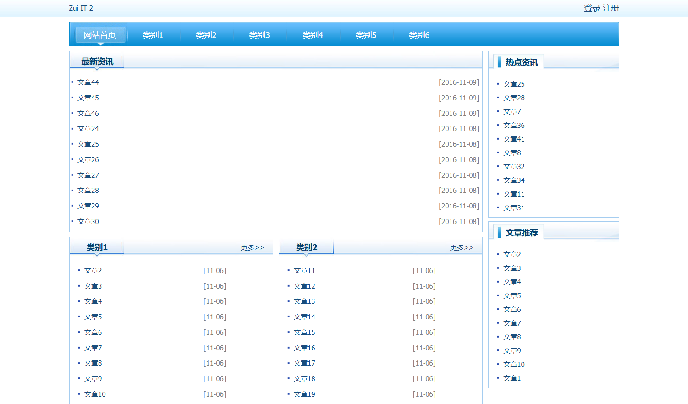
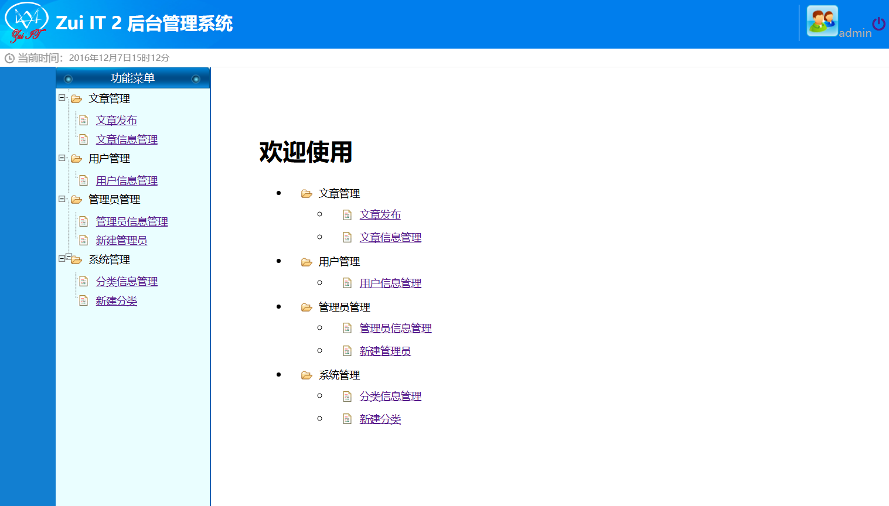
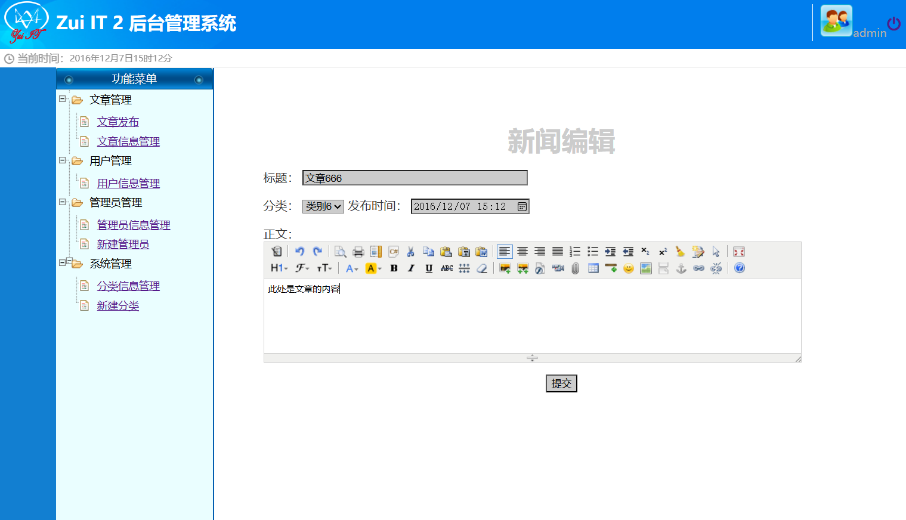

# ZuiIT21

[中文](README.md) | [日本語](README_ja.md)

基于 SSH（Spring、Struts、Hibernate）框架开发的新闻发布系统。

## 项目介绍

这是我在2017年完成的大学毕业设计。

当时还在一边工作一边做这个项目，每天都挺忙。现在回头看，很多具体过程已经记不太清楚了，只记得那段时间一直在写代码、改页面、查资料，最后总算把它做完了。（￣▽￣）

项目采用 B/S 架构，主要分为前台新闻浏览和后台内容管理两个部分。普通用户可以浏览、分类查看和点赞新闻，注册登录后还可以管理个人信息；管理员和作者则可以在后台发布文章，并对文章、分类、用户和管理员信息进行管理。

现在看来，这套技术和页面风格都已经很有年代感了，项目里也还留着一些当时没来得及修复的小问题。毕业答辩的时候，老师评价说，除了画面有点古老，代码还是可以的。∑( 口 ||

如果再给我一次机会，我大概会把界面做得更精美一些，也会把代码整理得更清楚。不过想了想，还是算了。保留当时的样子，反而更像是留下了一张过去的照片。

不知道等我退休以后，再回来翻看这个项目时，会是什么感受呢。`( ´ ▽ ` )`

<p align="center">
  
</p>

## 主要功能

### 前台功能

* 按分类浏览新闻
* 查看新闻标题、正文、作者、时间和阅读数据
* 新闻点赞
* 用户注册、登录和退出
* 登录验证码
* 查看和修改个人资料

### 后台功能

* 管理员和作者登录
* 使用富文本编辑器发布文章
* 为文章上传配图
* 查询、修改和删除文章
* 新增、修改和删除文章分类
* 查看和管理用户
* 启用或禁用用户账号
* 创建、修改、删除和管理管理员账号
* 根据管理员等级限制部分管理权限

<p align="center">
  
</p>

## 用户角色

系统中设计了四类用户角色。

### 超级管理员

拥有系统的主要管理权限，可以管理：

* 新闻文章
* 文章分类
* 普通用户
* 系统管理员
* 作者账号

### 系统管理员

可以使用后台管理功能，管理新闻、分类和用户，但部分管理员管理功能会受到权限等级限制。

### 作者

可以进入后台发布文章，并查看、修改和管理自己发布的内容。

### 普通用户

可以在前台浏览和点赞新闻，也可以注册、登录并维护个人信息。

## 系统结构

项目采用传统的 Java Web 分层结构：

```text
浏览器
  │
  ▼
JSP 页面
  │
  ▼
Struts Action
  │
  ▼
Service 业务逻辑
  │
  ▼
DAO 数据访问
  │
  ▼
Hibernate
  │
  ▼
MySQL
```

各层的主要职责如下：

* **JSP**
  负责前台和后台页面展示。

* **Struts 2**
  负责接收请求、调用 Action 和控制页面跳转。

* **Spring**
  负责对象管理、依赖注入，以及业务层和数据访问层之间的连接。

* **Hibernate**
  负责 Java 对象与数据库表之间的映射和数据持久化。

* **MySQL**
  保存新闻、分类、用户和管理员等数据。

## 文章发布

后台文章编辑页面使用 KindEditor 富文本编辑器，可以设置文章标题、分类和发布时间，并编辑文章正文。

<p align="center">
  
</p>

文章主要包含以下信息：

* 标题
* 正文
* 作者
* 发布时间
* 点击量
* 点赞或热度数据
* 文章分类

## 数据库设计

系统主要包含以下数据：

| 数据类型 | 主要内容                      |
| ---- | ------------------------- |
| 新闻文章 | 标题、正文、作者、时间、点击量、热度、分类     |
| 普通用户 | 账号、密码、昵称、性别、联系方式、生日、头像、状态 |
| 管理员  | 登录名、密码、名称、权限等级、状态         |
| 文章分类 | 分类名称                      |

## 使用技术

| 分类     | 技术                                          |
| ------ | ------------------------------------------- |
| 开发语言   | Java                                        |
| 页面技术   | JSP、HTML、CSS、JavaScript                     |
| 后端框架   | Spring 4.2.6、Struts 2.3.28、Hibernate 4.3.11 |
| 数据库    | MySQL 5.7                                   |
| 数据库连接  | MySQL JDBC 5.1.37                           |
| 前端库    | jQuery 1.8.3                                |
| 富文本编辑器 | KindEditor 4.1.10                           |
| Web服务器 | Apache Tomcat 8.0                           |
| Java环境 | JDK 1.7                                     |
| 开发工具   | Eclipse 4.5                                 |
| 开发环境   | Windows 10 64位                              |

## 项目目录

```text
ZuiIT21
├── screenshots
│   ├── front-home.png
│   ├── admin-dashboard.png
│   └── article-editor.png
│
├── src
│   └── com/zihao/ZuiIT21
│       ├── action
│       │   ├── admin
│       │   └── home
│       ├── bean
│       ├── dao
│       ├── enums
│       ├── service
│       └── util
│
└── WebContent
    ├── admin
    │   ├── css
    │   ├── images
    │   ├── js
    │   └── kindeditor
    ├── home
    │   ├── css
    │   ├── images
    │   └── js
    └── WEB-INF
        ├── content
        │   ├── admin
        │   └── home
        └── lib
```

## 补充说明

本仓库保存的是2017年毕业设计时期的代码，主要用于纪念和记录当时的学习过程。

由于项目依赖的 Java、框架和服务器版本都比较早，没有针对当前环境重新适配，也不保证可以直接在现代开发环境中运行。
